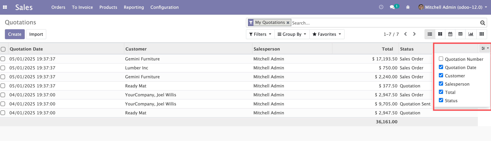
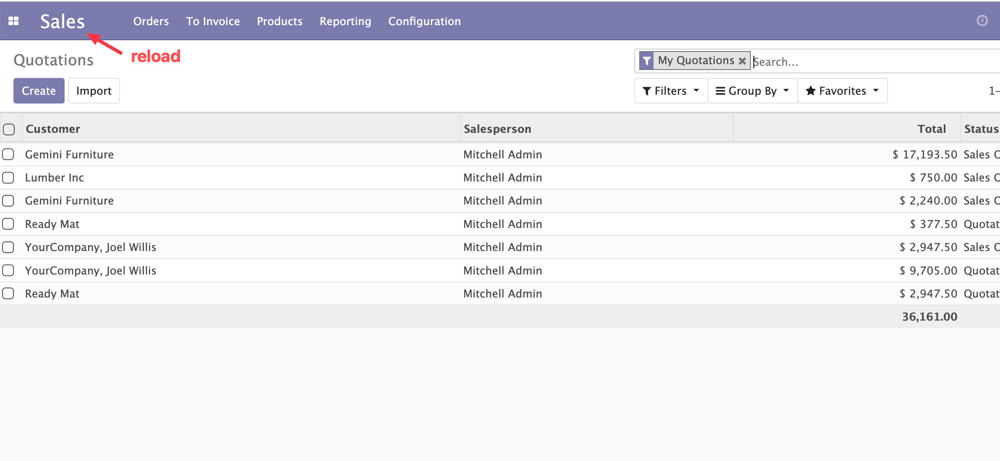

# List View Field Hidden

## Overview

**List View Field Hidden** is a powerful Odoo 12 module that allows users to customize list view columns visibility with persistent browser storage. This module enhances user experience by letting users hide/show columns in list views and automatically remembers their preferences across browser sessions.

## Features

### ✨ Key Features

- **Customizable Column Visibility**: Show or hide any column in list views with a simple click
- **Persistent Storage**: User preferences are saved in browser localStorage and persist across sessions
- **Works Everywhere**: Automatically works in:
  - Standard list views
  - One2many fields in form views
  - All Odoo list views without additional configuration
- **Smart Storage**: Uses stable storage keys to prevent localStorage bloat
- **Easy to Use**: Simple dropdown menu with checkboxes for each field
- **No Configuration Required**: Works out of the box after installation

### 🎯 Use Cases

- Hide columns you rarely use to focus on important data
- Customize list views per user preference
- Reduce visual clutter in complex list views
- Improve productivity by showing only relevant columns

## Installation

### Requirements

- Odoo 12.0
- Web module (included in base installation)

### Steps

1. Copy the `list_view_field_hidden` module to your Odoo addons directory
2. Update the apps list in Odoo
3. Search for "List View Field Hidden" in the Apps menu
4. Click "Install"

## Usage

### How to Use

1. **Open any list view** (e.g., Sales > Quotations)
2. **Locate the column chooser icon** (slider icon) in the top-right corner of the table header
3. **Click the icon** to open the dropdown menu
4. **Check/uncheck fields** to show or hide columns
5. **Your preferences are automatically saved** and will persist when you:
   - Refresh the browser
   - Navigate away and return
   - Close and reopen the browser

### Example

1. Navigate to **Sales > Quotations**
2. Click the **slider icon** (⚙️) in the table header
3. Uncheck "Quotation Number" to hide that column
4. The column disappears immediately
5. Navigate away and return - your preference is remembered!

## Technical Details

### Storage

- Preferences are stored in browser localStorage
- Storage key format: `odoo12_lvfh:{model}:{view_id}`
- Automatically migrates from old storage keys
- Includes cleanup mechanism to prevent localStorage bloat

### Compatibility

- **Odoo Version**: 12.0
- **Dependencies**: web
- **License**: OPL-1

## Screenshots

### Column Chooser Dropdown

*The column chooser dropdown menu allows you to toggle column visibility with checkboxes.*

### Hidden Columns

*Hidden columns are automatically remembered and applied when you return to the view.*

## Demo Video

You can watch a quick feature demo on YouTube:  
[List View Field Hidden Demo](https://youtu.be/nCzf6QQLRMg)

## Support

For issues, questions, or contributions, please contact:
- **Email**: hb.luojun@outlook.com

## Pricing

This module is available for **$10.00 USD** on the Odoo Apps Store.

## Changelog

### Version 12.0.1.0.0
- Initial release
- Column visibility toggle functionality
- Persistent browser storage
- Support for list views and one2many fields
- Automatic storage key migration
- Cleanup mechanism for old storage keys

## License

This module is licensed under OPL-1 (Odoo Proprietary License v1.0).

---

**Author**: qianxunman  
**Version**: 12.0.1.0.0  
**Category**: Tools

